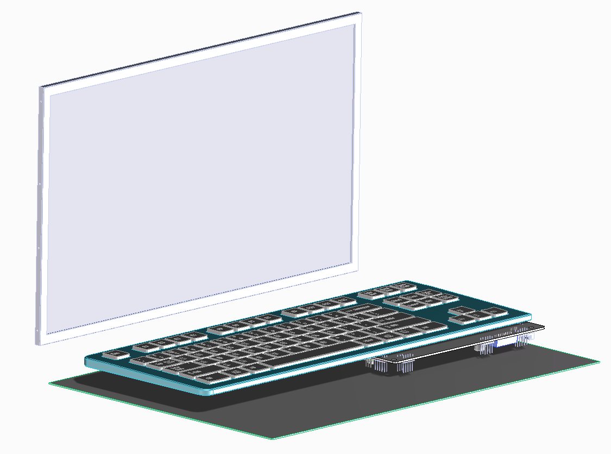

# What is this

Open Source PC casing in Laptop form. Based on industry standards for everyday use.

# Goals

- Build/develop and maintain your laptop, as you do with your desktop computer.
- The baseline size factor somewhere around Lenovo T520/W520 (The last known useable laptop in history.)
- Daily useable computer. So: Up to date x86 architecture, Windows. 

Project ceases: If laptop manufacturers starts to build laptops again with _keyboards_, not with randomly placed buttons.

# Current ideas

- Thin Mini ITX mainboard
  - Low power processor used (<35W)
  - Laptop memories
- USB Keyboard (internal connectors)
- Touchpad : TBD
- Mouse : USB (external)
- Display : some LVDS 40 panel with case and hinge, (some eDP or HDMI display would be better, but this is just wishful thinking)
- Case: Self made, bent/welded aluminium plate casing, 3D printed plastic parts
- Battery/power management : TBD Currently only external power
- Sound : TBD Currently external sound

# Hardware ideas

- Motherboard options
  - ASUS Pro H410T/CSM https://www.asus.com/motherboards-components/motherboards/business/Pro-H410T-CSM
  - AAEON MIX-Q370D1 https://www.aaeon.com/en/p/mini-itx-motherboards-mix-q370d1
  - ASUS PRIME H310T R2.0/CSM https://www.asus.com/Motherboards-Components/Motherboards/Business/PRIME-H310T/
  - Asrock IMB-1216 https://www.asrockind.com/IMB-1216
  - Asrock X300TM-ITX https://www.asrock.com/MB/AMD/X300TM-ITX/index.asp#Overview
- Processor/memory 
  - As motherboard requests
- Cooling
  - Heatpipies https://www.aliexpress.com/item/32446947034.html
  - Passive cooling through alu case
  - Active cooling with thin coolers https://www.thermaltake.com/C_00003213.htm
  - Intel Thermal Solution HTS1155lp https://www.ebay.com/itm/334085185276
- Display
  - Cabling TBD
    - https://www.hklrf.com/LVDS-Cable-for-screen-Asus-N56J-40-pin-p-n-14005-01140000-DDNJ8GLC100-14005-01140100_5180.html
    - https://hardwarerecs.stackexchange.com/questions/13080/lvds-for-asus-h310t-r2-0
    - https://forums.anandtech.com/threads/lvds-cable-for-the-asus-prime-h310t-csm.2563250/
    - https://www.ebay.com/itm/194591997846?hash=item2d4e963f96:g:yZMAAOSwLCRc93UY
    - LVDS 30 Cable for X300TM-ITX https://www.ebay.com/itm/252878881711?hash=item3ae0c183af:g:RBgAAOSwmCVY9cDk
    - LVDS 40 Cable between X300TM-ITX and LP156WD1 https://www.ebay.com/itm/154290360394
  - Panels/Display assemblies TBD
    - LVDS 40 displays
    - eDP displays
    - LP156WD1 LCD panel (from Lenovo T520) 
 - Keyboard
  - Modified HAMA Casano http://hama.hu/termekek/44-pc-notebook/49-billentyuzet/a791-billentyuzet-casano

# Good Source

http://roddines.blogspot.com/2015/12/thin-mini-itx-motherboard-overview.html

# Current tasks

- Display connection proof of concept
  - Buy mainboard
    - DONE. (Asrock X300TM-ITX) Waiting for delivery. 
  - Buy display
    - DONE. I will use my spare LG LCD panel. (LP156WD1)
  - Buy/manufacture display cable
    - DONE. (https://www.ebay.com/itm/154290360394) Waiting for delivery.
  - Buy processor.
  - Buy memory.
  - Assemble power supply solution. (Probably first a simple cable with Lab PSU)
  - Prove working display

