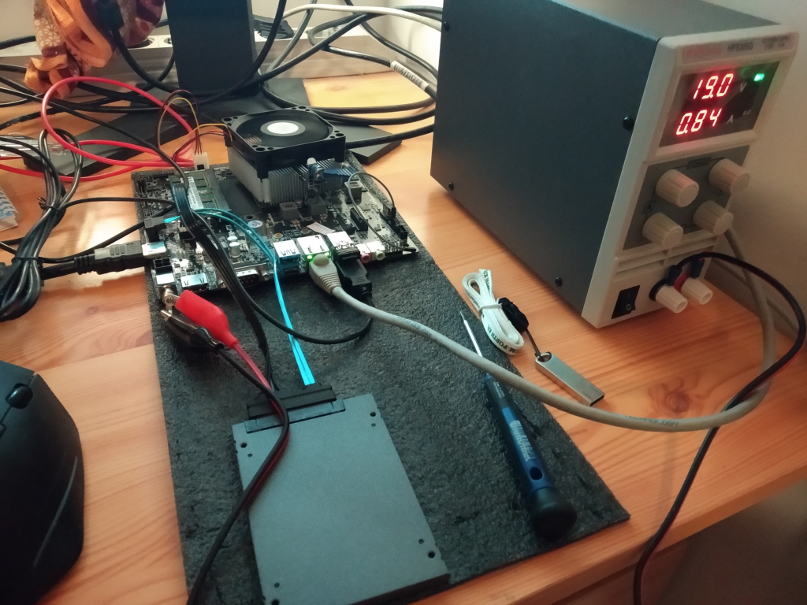
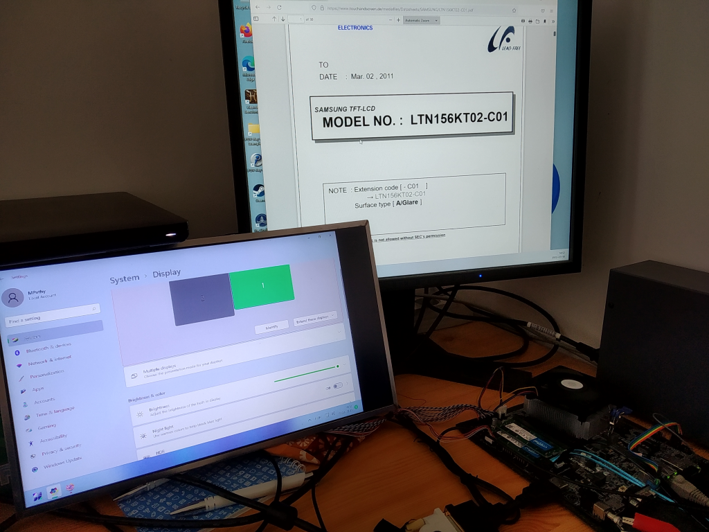
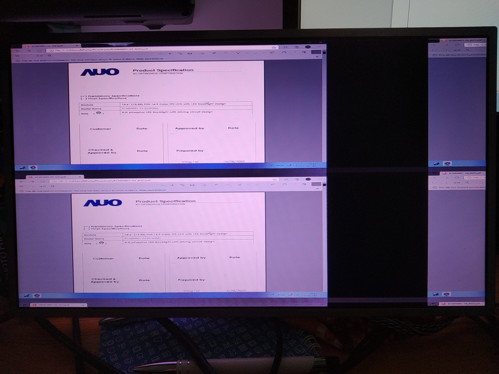

# Display connection proof of concept

  - Buy mainboard
    - DONE. (Asrock X300TM-ITX) Delivered.
      - 5V on USB looks ok, not starting without processor. Needs processor and memory for further tests.
  - Buy display
    - DONE. I will use my spare LG LCD panel. (LP156WD1)
  - Buy/manufacture display cable
    - DONE. (https://www.ebay.com/itm/154290360394) Delivered.
  - Buy processor.
    - Ryzen 7 Pro 5700GE would be optimal, but can't found anywhere. A Ryzen 7 Pro 5750GE is unnecessary and more expensive, but it can be purchased.
      - 5750GE From Germany https://direkt.jacob.de/produkte/amd-ryzen-7-100-000000257-artnr-7380434.html?utm_source=geizhals&utm_medium=cpc&utm_campaign=Preisvergleich&ref=103
        - Ordered. Delivered.
  - Buy memory.
    - DONE. Crucial CT16G4SFRA32A (2pcs) Delivered.
  - Assemble power supply solution. (Probably first a simple cable with Lab PSU)
    - DONE.
  - Mainboard, memory, CPU asembled. Wont POST.
    - CPU Came one pin bent. For this reason i was not able to put it correctly into the socket. (My eyes starting to go bad) The first power ups were tested halfway in the socket. It consumed 0.4 A with 19.5V. After i discovered the problem, it consumes 0.8A. Still wont POST.
    - Power LED won't lit up. Not even measurable voltage on the pins.
    - Strange behaviour happened with my HDMI-DVI cable after the first attempt. The DVI input not works anymore on the monitor.
    - So far it is disappointing.
    - CPU is fine. Looks like, with Asrock main boards, firmware updates are very important. Experimenting with other motherboards, and firmware upgrades for them, i was able to bring the CPU to life.
    - Unfortunately i fried the X300TM-ITX. Accidentally i cranked up voltage instead of current limit on the lab PSU. The power input went to short.
      - Wrote to Asrock tech support what part to check/replace. Maybe it is just a bypass diode.
        - Asrock support not too supportive. Probably it is a bypass diode anyway. FIX. TODO.
    - Ordered new main board. System is up an running now. 
    - DONE.
    - By experience, this CPU sometimes takes 65W or more power. So the 35W limit not true at all.
  - Prove working display
    - Needs to remove display disable jumper and put it to display voltage selector. 3.3V tried.
    - Just realized, the panel needs 650V for the the backlight. Inverter needed.
      - Not needed. The exact model number of the LCD is LP156WD1-TL-B2. It needs ~12V. So we are ok. Only the swapping of connectors power and ground pins are necessary. 
    - Display comes up as CH7513A013. Probably this is the on board display controller chip, because independently from the LCD connection it is there as device.
    - 1600x900 option selected in EFI. Backlight is on, no image on LCD. Windows indetifies it as 1440x900 display.
      - Connections of the display cable looks fine.
      - Actually there are no EEDID pins on the mainboard, however the LCD supports it. Maybe there is the problem, the LCD tries/needs to negotiate before displaying anything, but can't. Let's assume Acrock's engineers knew what they do, so next step unpower EEDID.
    - With a different panel (Samsung LTN156KT02), but the same settings, there is image. Unfortunatelly the RGB is swapped, and the mainboard reports 1440x900 resolution, not only for windows, but also to the EFI. The EFI setting is still 1600x900x18bit for the LVDS) 
    - Another panel tried. AUO B156HW01 V4 Full-HD. There is image, but it is in multiple rows. And the RGB is bad.  
    - Question sent to Asrock support about supported LCD panels. They documentation lacks a list like this.
